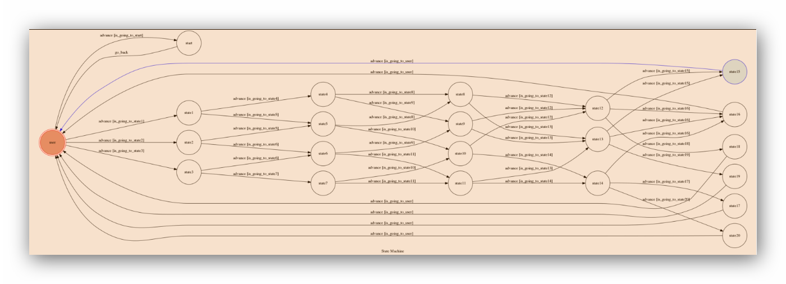

# TOC2017
TOC project


## Setup
1. By using ngrok, we can get webhookURL.
```sh
./ngrok http 5000
```
2. After changing the webhookURL, we can run it!

```sh
python3 app.py
```

3. Telegram!
Let's talk to my lovely bot.

4.Finite State Machine



